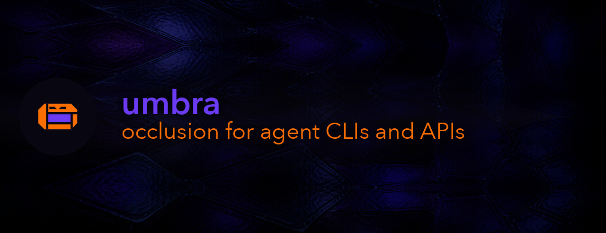

# umbra

occlusion for agent CLIs and APIs



Occlusion is the idea. umbra is a least-privilege boundary between an agent and
the host system, and what you did not declare does not get through. The boundary
lives in a KDL guardfile rather than in code, so it is one artifact a reviewer
reads in a sitting. umbra ships no denylist and knows nothing about your tools:
policy is yours, and umbra enforces it across two surfaces, `cli/` around
subprocess exec and `http/` around outbound requests.

It validates argv before `execve`, checks a scope token per verb, prunes every
upstream surface to what was granted, and appends every call to a rotating JSONL
audit log. A public exit-code taxonomy separates a policy refusal from a tool
failure. Full documentation in [docs/index.md](docs/index.md).

**umbra is not a sandbox.** It performs no execution isolation, and that is
deliberate rather than unfinished. Validating argv and auditing every call does
nothing to contain a process that is already running. Isolation is a container's
job, and umbra is the gate in front of it.

## Two ways in

**Generate the CLI.** `umbra` reads KDL policy plus committed locks out of a
`.umbra/` directory and builds a standalone guarded CLI with no hand-written
Go, over three transports: an HTTP API from its OpenAPI contract, a wrapped
binary, and an upstream MCP server. `--skills-out` also renders a native agent
skill and a lazy command index.

A wrapped binary may go one step further. A `replace` wrap is **installed under
the wrapped tool's own name**, ahead of it on PATH, so a caller types `git
commit` and the guardfile's grants are the whole `git` they can see. `umbra
install` places it and `umbra doctor` reports what it occludes, including the
finding that never passes: a PATH shim is what a caller sees rather than what a
caller can reach. See
[docs/execverb-replacement.md](docs/execverb-replacement.md).

**Import the primitives.** Every package stands alone if you are adding a
boundary to an existing [urfave/cli](https://github.com/urfave/cli) v3 app.
Nothing consumer-shaped leaks into the API.

```sh
GOPRIVATE=forgejo.coilysiren.me go get forgejo.coilysiren.me/coilyco-flight-deck/umbra
```

## Install umbra

```sh
brew tap coilyco-flight-deck/tap https://forgejo.coilysiren.me/coilyco-flight-deck/homebrew-tap
brew install coilyco-flight-deck/tap/umbra
```

```powershell
scoop bucket add coilyco-flight-deck https://forgejo.coilysiren.me/coilyco-flight-deck/scoop-bucket
scoop install coilyco-flight-deck/umbra
```

Tagged releases also publish raw binaries and `SHA256SUMS` for Linux, macOS, and
Windows on amd64 and arm64. `umbra --version` reports both the driver and the
umbra ref `lock` freezes by default. It shells out to the Go toolchain to resolve
locks and build, so Go has to be present.

## Try it

[`guides/quickstart.md`](guides/quickstart.md) goes from an empty terminal to a
`git` that can read your repository and cannot push it, assuming no checkout of
this one. [`guides/primitives.md`](guides/primitives.md) is the shortest look at
a refusal, and [`guides/`](guides/) holds one walkthrough per surface.

## Status and development

v0.x. Minor API breaks land on `main` with a note in the commit body and no
deprecation cycle, so pin a commit in your `go.mod` until v1.0.0. The API locks
once a second consumer lands. Forgejo is canonical and the GitHub mirror is
verified. umbra is deliberately unguarded, being the framework rather than a
consumer of one, so its dev verbs run through the [`justfile`](justfile):
`just build`, `just test`, `just lint`, `just vet`, and `just docs-cli` for the generated CLI reference.

## See also

- [AGENTS.md](AGENTS.md) - agent-facing operating rules.
- [a new issue](https://forgejo.coilysiren.me/coilyco-flight-deck/umbra/issues/new) - bugs and requests, under the [Code of Conduct](CODE_OF_CONDUCT.md) and [SECURITY.md](SECURITY.md).
- [mcp-beaver](https://forgejo.coilysiren.me/coilyco-flight-deck/mcp-beaver) - the sibling that renders a guardfile into a guarded MCP server.

MIT. See [LICENSE](LICENSE).
